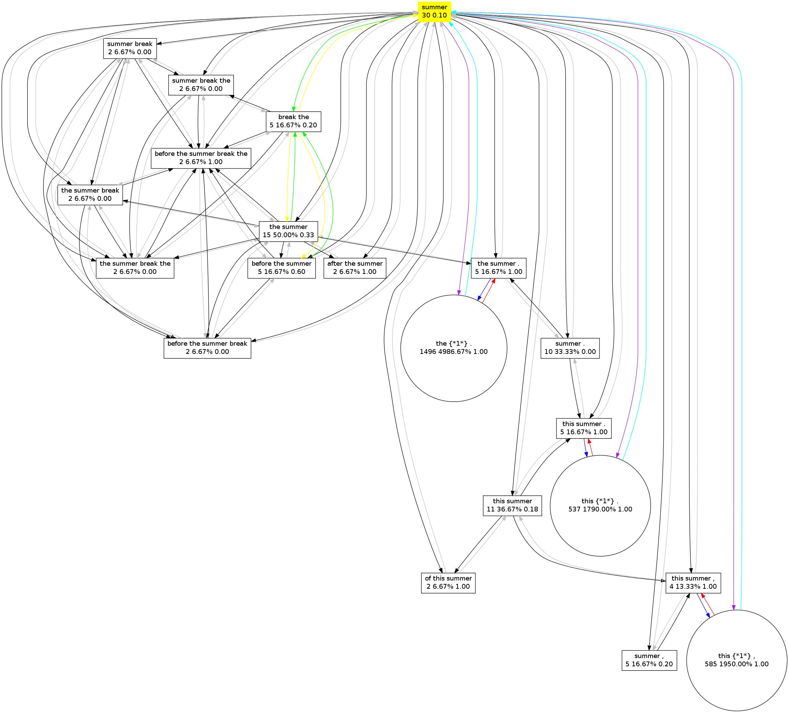

.. colibri documentation master file, created by
   sphinx-quickstart on Mon Oct  8 11:38:12 2012.
   You can adapt this file completely to your liking, but it should at least
   contain the root `toctree` directive.

****************************
Colibri Documentation 
***************************

Contents
===========

.. toctree::
   :maxdepth: 3

Introduction
===================

Colibri is a collection of software developed for the Ph.D. research project **Constructions as Linguistic Bridges**. This research examines the identification and extraction of aligned constructions or patterns across natural languages, and the usage of such constructions in Machine Translation. The aligned constructions are not identified on the basis of an extensive and explicitly defined grammar or expert database of linguistic knowledge, but rather are **implicitly** distilled from large amounts of example data. Our notion of constructions is broad and transcends the idea of words or variable-length phrases. We for instance seek to incorporate also constructions with one or more gaps. We investigate what methods lead to constructions that prove beneficial in a Machine Translation setting.

The software consists out of various tools, each of which will be discussed in this documentation. Because of the computational complexity and need to have the software deal as efficiently as possible with time and space constraints, almost everything is written in C++. The exception is the experiment framework surrounding the actual core software; this is written in Python. Depending on the size of your input corpus, certain tasks may take considerable memory. We recommend a Linux machine with at least 8GB RAM. 

This documentation will illustrate how to work with the various tools of colibri, as well as elaborate on the implementation of certain key aspects of the software.

Installation
===============

Colibri is hosted on github and should be retrieved through the versioning control system ``git``. This is done as follows::

	$ git clone git://github.com/proycon/colibri.git
	
You need to compile the software, but in order to do so you must first install the dependency ``Timbl``, a tarball is obtainable from http://ilk.uvt.nl/timbl/ , follow the instructions included with Timbl.

In addition to the compiler (``gcc``), colibri uses ``autoconf`` and ``automake``, so make sure these are installed on your system. Also install the package ``autoconf-archive`` if available on your distribution. Colibri can now be compiled and installed::

  $ cd colibri
  $ bash bootstrap
  $ ./configure
  $ make
  $ make install
  
You can optionally pass a prefix if you want to install colibri in a different location::

  $ ./configure --prefix=/usr/local/
 
Keeping colibri up to date
-------------------------

Colibri is always under heavy development. Update your colibri copy by issueing a git pull::

 $ git pull
 
And then recompile as per the above instructions.

General usage instructions
--------------------

Colibri consist of various programs, each of which will output an extensive overview of available parameters if the parameter ``-h`` is passed. Each program is designed for a specialised purpose, takes specific files for input and in turns outputs specific files. It is often needed to call multiple programs in succession to obtain the final analysis or model you desire. 

Corpus Class Encoding
================================

Introduction
----------------------

Computation on large datasets begs for solutions to keep memory consumption manageable. Colibri requires that input corpora are converted into a compressed binary form. In this form each word-type in the corpus is represented by a numeric class. Highly frequent word-types get assigned low class numbers and less frequent word-types get higher class numbers. The class is represented in a dynamic-width byte-array, rather than a fixed-width integer. The null byte has special significance and is used as delimiter between tokens. This implies that a class number may never contain a null byte in its representation. 

All internal computations of all tools in colibri proceed on this internal representation rather than actual textual strings, keeping running time shorter and memory footprint significantly smaller.

Class-encoding your corpus
-----------------------------------

When working with colibri, you first want to **class encode** your corpus. This is done by the program ``classencode``. It takes as input a *tokenised* monolingual corpus in plain text format, containing *one sentence per line*. Each line should be delimited by a single newline character (unix line endings). Colibri is completely agnostic when it comes to the character encoding of the input. Given a corpus file ``yourcorpus``, class encoding is done as follows::

	$ classencode -f yourcorpus

This results in two files:

 * ``yourcorpus.cls`` - This is the class file; it lists all word-types and class numbers.  
 * ``yourcorpus.clsenc`` - This is the corpus is encoded binary form. It is a lossless compression that is roughly half the size of the original  

If your corpus is not tokenised yet, you can use ucto (not part of colibri, see http://ilk.uvt.nl/ucto), this will also do sentence detection and output one line per sentence::

	$ ucto -L en -n untokenisedcorpus.txt > tokenisedcorpus.txt
	
The above sample is for English, several other languages are also supported.

Class-decoding your corpus
---------------------------

Given these an encoded corpus and a class file, the original corpus can always be reconstructed. This we call **class decoding** and is done using the ``classdecode`` program::
   
 $ classdecode -f yourcorpus.clsenc -c yourcorpus.cls
 
Output will be to ``stdout``.

.. _classencodetraintest:
Class-encoding with existing classes
----------------------------------------

Sometimes you want to encode new data using the same classes already used for another data set.When comparing corpora, it is vital that the same classes are used, i.e. that identical words are assigned identical numerical classes. This occurs also when you are working with a training set and a separate test set, or are otherwise interested in a comparative analysis between two comparable datasets. The initial class file is built on the training set, and it can be reused to encode the test set:

You can encode a dataset, here named ``testset`` using an existing class file, ``trainset.cls``, as follows::

   $ classencode -f testset -c trainset.cls 

This will result in an encoded corpus testset.clsenc and an **extended** class file testset.cls, which is a superset of the original trainset.cls, adding only those classes that did not yet exist in the training data.

Pattern Finder
===============================

Introduction
-----------------------

The ``patternfinder`` program is used to extract recurring patterns from a monolingual corpus. This results in a pattern model. The extracted patterns are n-grams or skip-grams, where a skip-gram is like an n-gram with one or more gaps of a predefined size. The representation consists of a byte-array where a null byte separates words, each represented by a class number. Gaps are expressed by two consecutive null bytes, the configuration of the gap sizes is stored in a separate byte-array.

The pattern finding algorithm is iterative in nature and it guaranteed to find all n-grams above a specified occurrence threshold and given a maximum size for n. It does so by iterating over the corpus n times, iterating over all possible values for n in ascending order. At each iteration, a sliding window extracts all n-grams in the corpus for the size is question. An n-gram is counted in a hashmap data structure only if both n-1-grams it by definition contains are found during the previous iteration with an occurrence above the set threshold. The exception are unigrams, which are all by definition counted if they reach the threshold, as they are already atomic in nature. At the end of each iteration, n-grams not making it to the occurrence threshold are pruned. This simple iterative technique reduces the memory footprint compared to the more naive approach of immediately storing all in a hashmap, as it prevents the storing of lots of patterns not making the threshold by discarding them at an earlier stage. 

At the beginning of each iteration of n, all possible ways in which any n-gram of size n can contain gaps is computed. When an n-gram is found, various skip-grams are tried in accordance with these gap configurations. This is accomplished by 'punching holes' in the n-gram, resulting in a skip-gram. If all consecutive parts of this skip-gram were counted during previous iterations and thus made the threshold, then the skip-gram as a whole is counted, otherwise it is discarded. After each iteration, pruning again takes places to prune skip-grams that are not frequent enough.

The pattern finder can create either indexed or unindexed models. For indexed models, the precise location of where an n-gram or skipgram instance was found in the corpus is recorded. This comes at the cost of much higher memory usage. Other colibri tools such as the ``grapher`` and ``aligner`` demand an indexed pattern model as input. For skipgrams in indexed models, the various fillings for the gaps are recorded explicitly. If you are only interested in simple n-gram or simple skip-gram counts, then an unindexed model may suffice. 

Creating a pattern model
---------------------------

First make sure to have class encoded your corpus. Given this encoded corpus, ``patternfinder`` can be invoked as follows to produce an indexed pattern model. The occurrence threshold is specified with parameter ``-t``, patterns occuring less will not be counted. The default value is two.  The maximum value for n, i.e. the maximum n-gram/skipgram size, is set using the parameter ``-l``, it defaults to 9:: 

	$ patternfinder -f yourcorpus.clsenc -t 10 
	
This will result in a pattern model ``yourcorpus.indexedpatternmodel.colibri``. This model is stored in a binary format. To turn it into a human readable presentation it needs to be decoded. The ``patternfinder`` program can do this by loading the model using the ``-d`` flag, provided you also pass the class file needed for class decoding using ``-c`` parameter::

	$ patternfinder -d yourcorpus.indexedpatternmodel.colibri -c yourcorpus.cls
	
Output will be to stdout in a tab delimited format, facilitating easy parsing. An excerpt follows::

	#TYPES=89126;TOTALTOKENS=681047
	#N      CLASS   OCC.COUNT       TOKENS  COVERAGE        FREQ-ALL        FREQ-G  FREQ-N  SKIPTYPES       ENTROPY REFERENCES
	3       the criteria of 3       9       1.321494698603767e-05   2.054269696851421e-06   2.054269696851421e-06   1.43282213423633e-05    0       -       1028:15 4342:43 14772:15 
	1       picking 3       3       4.404982328679225e-06   2.054269696851421e-06   2.054269696851421e-06   4.502354731524587e-06   0       -       2289:2 5825:20 13913:47 
	2       and interests   5       10      1.468327442893075e-05   3.423782828085701e-06   3.423782828085701e-06   1.056798703096632e-05   0       -       225:20 2466:47 2796:14 12622:13 21237:22 

The various columns are:

* **N** - The length of the n-gram or skipgram in words
* **Class** - The actual pattern. Gaps in skipgrams are represented as ``{*x*}`` where x is a number representing the size of the skip. 
* **Occurrence count** - The absolute number of times this pattern occurs
* **Tokens** - The absolute number of tokens in the corpus that this pattern covers. Computed as ``occurrencecount * n``. 
* **Coverage** - The number of covered tokens, as a fraction of the total number of tokens.
* **Frequency over all** - The frequency of the pattern, as a fraction of the sum of all n-grams and skipgrams 
* **Frequency within group** - The frequency of the pattern, as a fraction of either all n-grams or all skipgrams, depending on the nature of the pattern.
* **Frequency within n** - The frequency of the patterns, as a fraction of either all n-grams or all skipgrams of the same size (again depending on the nature of the pattern).
* **Skip-types** - The number of unique types in the skip content, i.e. the number of unique ways in which gaps can be filled (only for skip-grams, 0 otherwise)
* **Entropy** - The entropy over the skip content distribution.
* **References** - A space-delimited list of indices in the corpus that correspond to a occurrence of this pattern. Indices are in the form ``sentence:token`` where sentence starts at one and token starts at zero. This column is only available for indexed models.
 

The pattern model created in the previous example did not yet include skip-grams, these have to be explicitly enabled with the ``-s`` flag. When this is used, several other options become available for consideration:

* ``-B`` - Do **not** include skipgrams that start with a gap.
* ``-E`` - Do **not** include skipgrams that end with a gap.
* ``-T [value]`` - Skip content threshold value. Only skip content that occurs at least this many times will be considered. This is an extra occurrence threshold that applies to the amount of occurrences that can fill the gaps. The defaut is the same as the over-all threshold ``-t``. Moreover, this value 
* ``-S [value]`` - Type threshold value. Skipgrams will only be included if they have at least this many unique types as skip content, i.e. if there are at least this many options to fill the gaps. The default is two. Note that ``-S`` applies to types whereas ``-T`` applies to tokens. The default value is two.

Here is an example of generating an indexed pattern model including skipgrams::

	$ patternfinder -f yourcorpus.clsenc -t 10 -s -S 3 -B -E

If you want to generated unindexed models, simply add the flag ``-u``. Do note that for unindexed models the parameter ``-S`` is set unchangeably to two and and ``-T`` is set fixed to the same value as ``-t``. When decoding an unindexed model, also add the ``-u`` flag, as shown in the next example.  Note that indexed models can be always read (and decoded) in an unindexed way (with the ``-u`` flag), but unindexed models can not be read in an indexed way, as they simply lack indices::

	$ patternfinder -d yourcorpus.unindexedpatternmodel.colibri -c yourcorpus.cls -u 
	$ patternfinder -d yourcorpus.indexedpatternmodel.colibri -c yourcorpus.cls -u 

Training and testing coverage
--------------------------------

An important characteric of pattern models lies in the fact that pattern models can be compared. More specifically, you can train a pattern model on a corpus and test it on another corpus, which yields another pattern model containing only those patterns that occur in both training and test data. The difference in count, frequency and coverage can then be easily be compared.

Make sure to use the same class file for all datasets you are comparing. Instructions for this were given in :ref:`classencodetraintest`::
  
   $ patternfinder -f trainset.clsenc -t 10 -s -B -E
   $ patternfinder -d trainset.indexedpatternmodel.colibri -f testset.clsenc -t 10 -s -B -E
 
This results in a model ``testset.colibri.indexedpatternmodel``. This model can be used to generate a coverage report using the ``-C`` flag::

   $ patternfinder -d yourcorpus.indexedpatternmodel.colibri -C  

	EXAMPLE OUTPUT:

		  COVERAGE REPORT
	----------------------------------
	Total number of tokens:      6258043

		                          TOKENS  COVERAGE  TYPES        TTR     COUNT FREQUENCY
	Total coverage:              6095775    0.9741 298298 123969.960  23769771    1.0000
	Uncovered:                    162268    0.0259

	N-gram coverage:             6095772    0.9741 174363    34.9602  13357746    0.5620
	 1-gram coverage:            6095772    0.9741  16977     0.0028   6095772    0.2565
	 2-gram coverage:            5399143    0.8628  66845     0.0124   4353264    0.1831
	 3-gram coverage:            2298818    0.3673  55001     0.0239   1918446    0.0807
	 4-gram coverage:             615552    0.0984  22227     0.0361    633196    0.0266
	 5-gram coverage:              80184    0.0128   8002     0.0998    213206    0.0090
	 6-gram coverage:              19643    0.0031   3046     0.1551     81033    0.0034
	 7-gram coverage:               5174    0.0008   1414     0.2733     39487    0.0017
	 8-gram coverage:               2732    0.0004    851     0.3115     23342    0.0010

	Skipgram coverage:           2871204    0.4588 123935    23.1670  10412025    0.4380
	 3-skipgram coverage:        1819730    0.2908  23063     0.0127   2088113    0.0878
	 4-skipgram coverage:        1380211    0.2205  19573     0.0142   1494049    0.0629
	 5-skipgram coverage:         757273    0.1210  21957     0.0290   1994542    0.0839
	 6-skipgram coverage:         299785    0.0479  20698     0.0690   1669473    0.0702
	 7-skipgram coverage:         137551    0.0220  18281     0.1329   1525863    0.0642
	 8-skipgram coverage:          81042    0.0130  20363     0.2513   1639985    0.0690

The coverage report shows the number of tokens covered by n-grams or skipgrams, split down in different categories for each n. The **coverage** column shows this value as a fraction of the total number of tokens in the corpus. It shows how much of the test set is covered by the training set. The **types** column shows how many unique patterns exist in the category. The **count** columns shows their absolute occurrence count and the **frequency** column shows their over-all frequency. The fact that the occurrence count can be higher than the absolute number of tokens covered is due to the fact that n-grams and skipgrams inherently show considerable overlap when grouped together.

A coverage report can be generated for any **indexed** pattern model; including models not generated on a separate test set.

Query mode
--------------

The pattern finder has query mode which allows you to quickly extract patterns from test sentences or fragments thereof. The query mode is invoked by loading a pattern model (``-d``), a class file (``-c``) and the ``-Q`` flag. The query mode can be run interactively as it takes input from ``stdin``, one **tokenised** sentence per line. The following example illustrates this, the sentence "This is a test ." was typed as input::

	$ patternfinder -d europarl25k-en.indexedpatternmodel.colibri -c europarl25k-en.cls -Q                                                        
	Loading model
	Loading class decoder europarl25k-en.cls
	Loading class encoder europarl25k-en.cls
	Starting query mode:
	1>> This is a test .
	1:0	This	1085	0.001593135275538986
	1:0	This is	395	0.001159978679885529
	1:0	This is a	64	0.0002819188690354704
	1:0	This {*1*} a	66	0.0002907288336928288
	1:1	is	10570	0.0155202210713798
	1:1	is a	947	0.002781012176839484
	1:2	a	10272	0.01508265949339767
	1:2	a test	2	5.8733097715723e-06
	1:3	test	30	4.404982328679225e-05
	1:4	.	23775	0.03490948495478285

The output starts with an index in the format ``sentence:token``, the pattern found, and the two values are the absolute occurrence count and the coverage ratio.

Graph Models
===================

Introduction
---------------------

A pattern model contains a wide variety of patterns; a graph model goes a step further by making explicit relationships between the various patterns in this model. These relationships can be visualised as a directed graph, in which the nodes represent the various patterns (n-grams and skipgrams), and the edges represent the relations. The following relations are distinguished; note that as the graph is directed relations often come in pairs; one relationship for each direction: 

* *Subsumption relations* - Patterns that are subsumed by larger patterns are called **children**, the larger patterns are called **parents**. These are the two subsumption relations that can be extracted from an indexed pattern model.
* *Successor relations*  - If a pattern A and a pattern B form part of a combined pattern A B, then the two patterns are in a successor/predecessor relationship.
* *Template relations* - Template relations indicate abstraction and go from n-grams to skipgrams. An example of a template relation is ``to be or not to be`` to ``to be {*1*} not {*1*} be``. The reverse direction is called the instance-relationship, as an specific n-gram is an instance of a more abstract template.
* *Skip content relations* - Relations between patterns that can be used to fill the gaps of higher patterns are called skip content relations. These can go in two directions; skipgram to skip content and skip content to skipgram. Example: ``to`` is a in a skip-content to skipgram relationship with  ``to be {*1*} not {*1*} be``.

In addition to the relations, a graph model can also compute a so-called **exclusivity count** and **exclusivity ratio** for each pattern. The exclusivity count of a pattern is the number of times the pattern occurs in the data **without** being subsumed by a larger found pattern. This exclusivity ratio is the exclusity count as a fraction of the total occurrence count for the pattern. An exclusivity ratio of one indicates that the pattern is fully exclusive, meaning it is not subsumed by higher-order patterns. This notion of exclusivity may be of use in assessing compositionality of patterns. 

Computing a graph model
------------------------

The ``grapher`` program computes a graph model on the basis of an **indexed** pattern model created with ``patterfinder``. When computing a model, you need to explicitly specify which relations you desire to extract and include in your model. The more relations you include, the more memory will be required. To keep the models as small as possible, it is recommended to include only the relations you need. The following flags are available:

*	``-P`` - Compute/load subsumption relations from children to parents (reverse of -C)
*	``-C`` - Compute/load subsumption relations from parents to children (reverse of -P)
*	``-S`` - Compute/load subsumption skipgram to skipcontent relations
*	``-s`` - Compute/load subsumption skip-content to skipgram relations (reverse of -S)
*	``-L`` - Compute/load subsumption predecessor relations (constructions to the left)
*	``-R`` - Compute/load subsumption sucessor relations (constructions to the right)
*	``-T`` - Compute/load subsumption template relations
*	``-I`` - Compute/load subsumption instance relations (reverse of -T)
*	``-a`` - Compute/load subsumption all relations
*   ``-X`` - Compute/load exclusivity count/ratios

The indexed pattern model that acts as input is specified using the ``-f`` flag. The following example generates a graph model with all relations::

	$ grapher -f yourcorpus.indexedpatternmodel.colibri -a
 
The graph model will be stored in binary form, in the file ``yourcorpus.graphpatternmodel.colibri``. 

Viewing and querying a graph model
----------------------------------

To decode this binary graph model into human readable form, read it in using the ``-d`` flag and pass a class file. In addition, you again need to pass what relations you want to load, as it is also possible to only load a subset of the relations. Simply use the ``-a`` flag if you want to load and output relations existing in the model::

  $ grapher -d yourcorpus.graphpatternmodel.colibri -c yourcorpus.cls -a

This will result in output to ``stdout`` in a tab-separated format, as illustrated below::

	#N      VALUE   OCC.COUNT       TOKENS  COVERAGE        XCOUNT  XRATIO  PARENTS CHILDREN        TEMPLATES       INSTANCES       SKIPUSAGE       SKIPCONTENT     SUCCESSORS      PREDECESSORS
	4       the summer break the    2       8       1.17466195431446e-05    0       0       1       8       1       0       0       0       0       1       
	2       that sustainable        2       4       5.8733097715723e-06     0       0       1       2       0       0       0       0       0       0       
	2       Kosovo ,        20      40      5.8733097715723e-05     4       0.2     5       2       0       0       1       0       0       1       
	2       which refer     2       4       5.8733097715723e-06     0       0       2       2       0       0       0       0       1       0       
	2       relief ,        2       4       5.8733097715723e-06     2       1       0       2       0       0       0       0       0       0       
	6       rule of law and respect for     3       18      2.642989397207535e-05   1       0.3333333333333333      2       20      0       0       1       0       0       2  

In the above example, only the number of relations for each type is shown, if you want to view the actual relations, you need to instruct ``grapher`` to output the the whole graph by adding the ``-g`` flag::

  $ grapher -d yourcorpus.graphpatternmodel.colibri -c yourcorpus.cls -a -g

	#N      VALUE   OCC.COUNT       TOKENS  COVERAGE        XCOUNT  XRATIO  PARENTS CHILDREN        TEMPLATES       INSTANCES       SKIPUSAGE       SKIPCONTENT     SUCCESSORS      PREDECESSORS
	4       the summer break the    2       8       1.17466195431446e-05    0       0       1       8       1       0       0       0       0       1       
	Parent relations - 1
		    before the summer break the     2       10      1.468327442893075e-05   2       1
	Child relations - 8
		    the     44027   44027   0.06464605232825341     90      0.002044200149908011
		    the summer      15      30      4.404982328679225e-05   5       0.3333333333333333
		    the summer break        2       6       8.80996465735845e-06    0       0
		    summer  30      30      4.404982328679225e-05   3       0.1
		    break   17      17      2.496156652918227e-05   2       0.1176470588235294
		    break the       5       10      1.468327442893075e-05   1       0.2
		    summer break the        2       6       8.80996465735845e-06    0       0
		    summer break    2       4       5.8733097715723e-06     0       0
	Predecessor relations - 1
		    before  357     357     0.0005241928971128277   36      0.1008403361344538
	Templates - 1
		    the {*2*} the   3266    13064   0.01918222971395513     3266    1

Outputting the whole graph may however produce a lot of unwanted output. Often you want to query your graph model for only one pattern. This is done with the ``-q`` parameter. In the following example we query our model for the pattern "summer"::

	$ grapher -d yourcorpus.graphpatternmodel.colibri -c yourcorpus.cls -a -q "summer"

	Outputting graph for "summer"
	Query:
		summer	30	30	4.40498e-05	3	0.1
	Parent relations - 16
		summer break	2	4	5.87331e-06	0	0
		after the summer	2	6	8.80996e-06	2	1
		the summer break the	2	8	1.17466e-05	0	0
		this summer .	5	15	2.20249e-05	5	1
		before the summer break	2	8	1.17466e-05	0	0
		of this summer	2	6	8.80996e-06	2	1
		the summer .	5	15	2.20249e-05	5	1
		before the summer	5	15	2.20249e-05	3	0.6
		the summer	15	30	4.40498e-05	5	0.333333
		before the summer break the	2	10	1.46833e-05	2	1
		this summer	11	22	3.23032e-05	2	0.181818
		the summer break	2	6	8.80996e-06	0	0
		this summer ,	4	12	1.76199e-05	4	1
		summer .	10	20	2.93665e-05	0	0
		summer ,	5	10	1.46833e-05	1	0.2
		summer break the	2	6	8.80996e-06	0	0
	Successor relations - 1
		break the	5	10	1.46833e-05	1	0.2
	Skipusage - 3
		this {*1*} ,	585	1755	0.00257691	585	1
		this {*1*} .	537	1611	0.00236548	537	1
		the {*1*} .	1496	4488	0.00658985	1496	1

It is possible to actually visualise the graph, ``grapher`` can output to the so-called dot-format used by the open-source graph visualisation software ``graphviz``. You can output in this format by specifying the ``-G`` flag. This works both with and without ``-q``, but if you do not specify a query the graph may turn out to be too huge to visualise::

	$ grapher -d yourcorpus.graphpatternmodel.colibri -c yourcorpus.cls -a -q "summer" -G > summer.dot
 
Graphviz will do the actual conversion to an image file, such as png::
 
	$ dot -Tpng summer.dot -o summer.png
 
This generated the following image::

.. TODO: Coverage report

Alignment Models
=====================

Introduction
--------------

An alignment model establishes a translation from patterns in one model to patterns in another. Each alignment has an associated score, or a vector of multiple scores. Alignments can currently be computed in three ways, all of which are unsupervised, and the of which the last method is the superior one:

# Co-occurrence (Jaccard) - Alignments are established according to simple Jaccard co-occurrence
# Expectation Maximisation - Alignments between patterns are computed in a fashion similar to IBM Model 1, using Expectation Maximisation. Computation proceeds over the matrix of all patterns, rather than a matrix of mere words as in IBM Model 1. 
# GIZA Word Alignments - Alignments are established on the basis of word-alignments computed with ``GIZA++``.

The pattern models have to be generated on the basis of a parallel corpus. In order to compute an alignment model you need to start with the right input; a parallel corpus. For colibri a parallel corpus consists of two corpus files, each for one language. The sentence on the n-th line of the both corpus files correspond and should be translations of eachother. Pattern and graph models can then be generated separately on both of these corpora. An indexed pattern model, or derived graph model, is required as input for the ``aligner`` program.

Co-occurrence
---------------------

Alignments computed solely on the basis of sentence co-occurrence are fairly weak. For all patterns that co-occur in at least one sentence, a Jaccard co-occurence score is computed as :math:`\fraction{|s \cap t|}{|s \cup t|}`, where *s* and *t* are sets of sentence numbers in which the pattern occurs. 

In the following example we translate French to English and assume pattern models have been computed already. Invoke the ``aligner`` program as follows, the ``-J`` flag chooses Jaccard co-occurrence:

 $ aligner -s fr.indexedpatternmodel.colibri -t en.indexedpatternmodel.colibri -J
 
This will result in an output file ``alignmodel.colibri``, which is in a binary format. If you want an alternative output filename you can specify it using the ``-o`` parameter.

Several other parameters adjust the behaviour of the alignment algorithm and output:

* ``-p [n]`` - Pruning value. Alignments with co-occurrence scores lower than *n* will be pruned (prior to any normalisation)
* ``-z`` - Disable normalisation. By default, the aligner will normalise all scores, if you want to retain the exact co-occurrence scores, pass this flag
* ``-b [n]`` - Best alignments only. Only the best *n* target alignments for a source pattern will be retained, others are pruned.
* ``-N`` - Do not attempt to directly align any skipgrams
 
Expectation Maximisation
----------------------------

This is an experimental method for computing alignments *directly* on the basis of the patterns. It is modelled after IBM Model 1 and uses the Expectation Maximisation algorithm to iteratively optimise the model's parameters.  The pseudo-code for the EM algorithm applied to this model is as follows::

   initialize t(t|s) uniformly
   do until convergence
   	  set count(t|s) to 0 for all t,s
  	  set total(s) to 0 for all s
      for all sentence pairs (t_s,s_s)
         set total_s(t) = 0 for all t
         for all patterns t in t_s
            for all patterns s in s_s
              total_s(t) += t(t|s)
         for all patterns t in t_s
             for all patterns s in s_s
                count(t|s) += t(t|s) / total_s(t)
                total(s)   += t(t|s) / total_s(t)
      for all s
     	for all t
           t(t|s) = count(t|s) / total(s)

In the following example we translate French to English and assume pattern models have been computed already. Invoke the ``aligner`` program as follows, the ``-E`` flag chooses Expectation Maximisation:

 $ aligner -s fr.indexedpatternmodel.colibri -t en.indexedpatternmodel.colibri -E

This will result in an output file ``alignmodel.colibri``, which is in a binary format. If you want an alternative output filename you can specify it using the ``-o`` parameter. 

Several other parameters adjust the behaviour of the EM alignment algorithm and output:

* ``-P [n]`` - Probability pruning value. Alignments with a probability lower than *n* will be pruned
* ``-M [n]`` - Maximum number of iterations (default: 10000)
* ``-v [n]`` - Minimum delta-value when convergence is considered to have been reached (default: 0.001)
* ``-z`` - Disable normalisation. By default, the aligner will normalise all scores, if you want to retain the exact co-occurrence scores, pass this flag
* ``-b [n]`` - Best alignments only. Only the best *n* target alignments for a source pattern will be retained, others are pruned.
* ``-N`` - Do not attempt to directly align any skipgrams, skipgrams tend to worsen alignment quality significantly.
* ``--null`` - Take into account zero-fertility words in EM
* ``-I 1`` - Compute bi-directional alignments and use one joint score. This will run the algorithm twice, once for each direction, and compute the intersection of the results.
* ``-I 2`` - Compute bi-directional alignments and use two separate scores, representing p(t|s) and p(s|t). This will run the algorithm twice, once for each direction, and compute the intersection of the results.

Instead of uniform initiatisation, this method can also be initialised using the co-occurrence method laid out in the previous section. Simply add the ``-J`` parameter to achieve this.

GIZA Alignment
-----------------

``GIZA++`` is open-source software for the computation of word alignment models according to the IBM Models and HMM models. The ``aligner`` program can use the models produced by GIZA++ and extract aligned pairs of phrases. Two GIZA models (``*.A3.final``) are required, one for each translation direction. This extraction algorithm is implemented as follows::

		function giza_extract(sentence_s,sentence_t, patterns_s, pattern_s):
            patterns_t = all patterns in sentence_t           
            for all word_s in sentence_s:
                patterns_s = find patterns BEGINNING WITH word_s
                for all pattern_s in patterns_s:
                    bestscore = 0
                    for all pattern_t in patterns_t:
                        aligned = 0
                        halfaligned = 0
                        unaligned = 0
                        firstsourcealigned = false
                        lastsourcealigned = false
                        firsttargetaligned = false
                        lasttargetaligned = false
                        for alignedsourceindex, alignedtargetindex in intersection:
                            if alignedsourceindex not in pattern_s or alignedtargetindex not in pattern_t:
                                aligned--; break;
                            else:
                                aligned++;
                                if alignedsourceindex == sourceindex: firstsourcealigned = true
                                if alignedsourceindex == sourceindex + patternsize_s: lastsourcealigned = true
                                if alignedtargetindex == targetindex: firstsourcealigned = true
                                if alignedtargetindex == targetindex + patternsize_t: lastsourcealigned = true
                            else:
                                unaligned++;                                
                        if ((aligned < 0) || (!firstaligned) || (!lastaligned)) break;
                        for alignedsourceindex, alignedtargetindex in union:                            
                            if (alignedsourceindex in pattern_s and alignedtargetindex not in pattern_t) or (alignedsourceindex not in pattern_s and alignedtargetindex in pattern_t):
                                halfaligned++;
                            else if not (alignedsourceindex in pattern_s and alignedtargetindex not in pattern_t):
                                halfaligned--;
                                        
                       if score > 0
                            bestscore = score
                            bestpattern_t = pattern_t                            
               
In the following example we translate French to English and assume pattern models have been computed already. Invoke the ``aligner`` program as follows, the ``-W`` flag chooses GIZA extraction and takes as parameters the two GIZA ``A3.final`` models (order matters!) separated by a colon. It is also necessary to pass the class the class file for both source (``-S``) and target language (``-T``), as the GIZA models do not use the colibri class encodings and thus need to be inpreted on the fly:

 $ aligner -s fr.indexedpatternmodel.colibri -t en.indexedpatternmodel.colibri -W fr-en.A3.final:en-fr.A3.final -S fr.cls -T en.cls

Several other parameters adjust the behaviour of the EM alignment algorithm and output:

* ``-a [n]`` - Alignment strength, value between 0 and 1. Determines how strong word alignments have to be if phrases are to be extracted, weak alignments will not be considered.
* ``-p [n]``-  Prune all alignments with a jaccard co-occurence score lower than specified (0 <= x <= 1). Uses heuristics to prune, final probabilities may turn out lower than they would otherwise be
* ``-c [n]`` - Prune phrase pairs that occur less than specified, here *n* is an integer representing the absolute count required for the phrase pair as a whole.
* ``-I 1`` - Compute bi-directional alignments and use one joint score. This does *not* run the algorithm twice, but is directly integrated.
* ``-I 2`` - Compute bi-directional alignments and use two separate scores, representing p(t|s) and p(s|t). This does *not* run the algorithm twice, but is directly integrated. 

Skipgram alignment
----------------------

Viewing an alignment model
----------------------------

An alignment model can be viewed by decoding it using the -d option and by passing it the class file for both source (``-S``) and target language (``-T``)::

	$ aligner -d alignmodel.colibri -S fr.cls -T en.cls
 
The output format is simple tab-delimited format.
 
MT Decoder
=====================
 
(yet to be written)
 
 
MT Experiment Framework
=======================

(yet to be written)

Indices and tables
==================

* :ref:`genindex`
* :ref:`modindex`
* :ref:`search`

